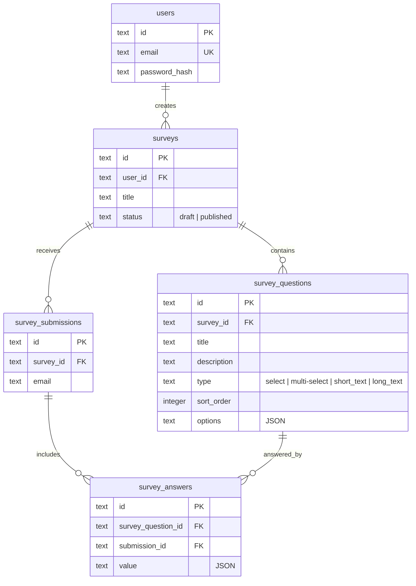

# Waterlily Survey App

A survey application with an authenticated authoring side and a public, login-free
response flow. Next.js frontend, Express + SQLite API, custom session authentication.

- **Design decisions and trade-offs:** [`DECISIONS.md`](./DECISIONS.md)
- **Data model as written during planning:** [`SCHEMA.md`](./SCHEMA.md)

---

## Quick start

Requires Node 20 or newer. Two terminals; both run in dev mode.

**Terminal 1 — API (port 3001)**

```bash
cd backend
cp .env.example .env      # PORT, DATABASE_URL, SESSION_SECRET
npm install
npm run db:push           # creates ./data/app.db from the Drizzle schema
npm run dev
```

**Terminal 2 — Web (port 3000)**

```bash
cd frontend
cp .env.example .env.local   # NEXT_PUBLIC_API_URL=http://localhost:3001
npm install
npm run dev
```

Then open http://localhost:3000, register with an email and a password of at least
8 characters, and create a survey. Publish it, open the share link in a private window,
and answer it as a respondent.

Health check: `curl localhost:3001/health`

---

## What's built

**Authoring (requires login)**

- Register, log in, log out — custom auth, session cookie
- Create surveys; add, edit, delete, and order questions
- Toggle a survey between `draft` and `published`
- Review all submissions for a survey, and drill into one submission's answers

**Responding (no account needed)**

- Open a published survey by link
- One question per screen, with title, description, and a text input
- Forward/back navigation and a progress indicator
- Client-side required-field validation
- On submit, the respondent sees their own answers back
- Returning to the link later re-opens that response, matched on the email given at
  submission time (remembered locally, re-enterable)

Of the brief's suggested improvements, I chose single-question display, forward/back
navigation, a progress indicator, and form validation — they compose into one coherent
flow rather than four separate features, and the per-question layout is what makes the
other three worth having. Reasoning in [`DECISIONS.md`](./DECISIONS.md).

---

## Architecture

```
backend/
  src/
    db/          Drizzle schema + connection
    models/      One class per table; all data access lives here
    routes/      Express routers (health, users, auth, surveys)
    middleware/  requireAuth, error handling
    lib/         scrypt password hashing, async handler, SQLite error mapping
frontend/
  src/
    app/         App Router pages (login, signup, dashboard, survey, submission)
    components/  admin/ authoring UI · survey/ respondent UI · ui/ primitives
    contexts/    Survey and sidebar state for the authoring side
    lib/         Typed API client
```

Routes never touch the database directly — they go through `models`, so validation and
SQL live in one place per table.

---

## Data model



Every table carries `created_at` / `updated_at`.

**Constraints and indexes**

| Constraint | Purpose |
| --- | --- |
| `unique(survey_question_id, submission_id)` | One answer per question per submission |
| `unique(survey_id, sort_order)` | No two questions share a position |
| `index(user_id, created_at DESC)` on surveys | The author's survey list |
| `index(survey_id, created_at DESC)` on submissions | The submissions table for a survey |

Answers are normalised one row per question, but `value` is JSON so a single column
holds short text, long text, a selected option, or an array of options — without a table
per question type or an EAV model. The alternatives considered are in
[`DECISIONS.md`](./DECISIONS.md).

---

## API

| Method | Path | Access |
| --- | --- | --- |
| `GET` | `/health` | Public |
| `POST` | `/users` | Public — register, starts a session |
| `POST` | `/auth/login` | Public |
| `POST` | `/auth/logout` | Session |
| `GET` | `/auth/me` | Session |
| `GET` | `/api/surveys` | Session — the caller's surveys |
| `POST` | `/api/survey` | Session |
| `PATCH` | `/api/survey/:id` | Session, owner — title and status |
| `POST` | `/api/survey/:id/question` | Session, owner |
| `PATCH` | `/api/survey/:id/question/:questionId` | Session, owner |
| `DELETE` | `/api/question/:id` | Session, owner |
| `GET` | `/api/survey/:id/submissions` | Session, owner |
| `GET` | `/api/survey/:id` | Public if published; owner may preview a draft |
| `POST` | `/api/survey/:id/submission` | Public, published surveys only |
| `GET` | `/api/survey/:id/submission?email=` | Public — a respondent's own response |
| `GET` | `/api/submission/:id` | Public |

Errors are JSON: `{ "error": "message" }` with a meaningful status — `400` validation,
`401` unauthenticated, `403` not the owner, `404` missing, `409` constraint conflict.

---

## Authentication

Custom, as the brief requires — no Clerk, no Supabase, and no auth framework.

- Passwords hashed with `scrypt` from `node:crypto`, a 16-byte random salt per password,
  compared with `timingSafeEqual`. Stored as `scrypt$<salt>$<key>`.
- Sessions are signed `httpOnly` cookies (`express-session`); `requireAuth` reads the
  session and attaches the user, and ownership is checked per route.
- Respondents are deliberately not accounts. A survey link is open, and identity is the
  email captured at submission — so answering costs nobody a signup.

---

## Tests

```bash
cd backend
npm test        # 44 tests across 7 files — models and routes
```

Route tests drive the real Express app through a session-bearing agent, covering
registration, login, ownership rejection, question ordering collisions, and the full
submit-then-review path. The frontend is typechecked (`npx tsc --noEmit`) but has no
component tests — a deliberate cut, noted in [`DECISIONS.md`](./DECISIONS.md).

---

## Known limitations

Listed in full, with what I would change given more time, in
[`DECISIONS.md`](./DECISIONS.md#known-gaps). The short version: `select` and
`multi-select` are modelled and validated server-side but the respondent UI renders
text questions only; required-field validation is client-side; multi-row writes are not
wrapped in transactions; and the schema is applied with `drizzle-kit push` rather than
committed migrations.
